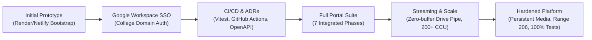

# ELITE Student Portal — Comprehensive Commit History & Changelog

> **Repository:** `elite-site/self-repo`  
> **Total Commits Documented:** 48 Commits (`71a5bb1` → `c197a96`)  
> **Branch:** `main`  
> **System Status:** 14/14 Test Suites Passing (66 Tests), Clean Production Builds (`backend`, `web`, `admin-client`)

---

## Table of Contents
1. [Executive Summary & Architectural Milestones](#executive-summary--architectural-milestones)
2. [Commit History by Chronological Era](#commit-history-by-chronological-era)
   - [Era 1: Initial Bootstrap & Cloud Deployment (Commits 1–8)](#era-1-initial-bootstrap--cloud-deployment-commits-18)
   - [Era 2: Roster Ingestion & Single Introduction Focus (Commits 9–14)](#era-2-roster-ingestion--single-introduction-focus-commits-914)
   - [Era 3: Google Workspace SSO, Supabase Identity & CI Pipeline (Commits 15–28)](#era-3-google-workspace-sso-supabase-identity--ci-pipeline-commits-1528)
   - [Era 4: Formal Engineering Standards: ADRs, OpenAPI & Runbooks (Commits 29–34)](#era-4-formal-engineering-standards-adrs-openapi--runbooks-commits-2934)
   - [Era 5: Enterprise Student Portal Expansion — Phases 1 to 7 (Commits 35–39)](#era-5-enterprise-student-portal-expansion--phases-1-to-7-commits-3539)
   - [Era 6: UX Polish, Theme Scoping & Public Directory (Commits 40–42)](#era-6-ux-polish-theme-scoping--public-directory-commits-4042)
   - [Era 7: 200+ Concurrency Scaling & Direct Drive Streaming (Commits 43–45)](#era-7-200-concurrency-scaling--direct-drive-streaming-commits-4345)
   - [Era 8: Permanent Video Persistence, Instant Controls & API Hardening (Commits 46–48)](#era-8-permanent-video-persistence-instant-controls--api-hardening-commits-4648)
3. [Full Chronological Commit Ledger (All 48 Commits)](#full-chronological-commit-ledger-all-48-commits)
4. [Functional Domain Matrix](#functional-domain-matrix)
5. [Current System Health & Verification Metrics](#current-system-health--verification-metrics)

---

## Executive Summary & Architectural Milestones

Across 48 commits, the platform evolved from an initial prototype into a resilient, high-concurrency campus portal handling student video introductions, portfolio showcases, department events, team collaborations, and admin moderation:



### Key Architectural Evolution
1. **Identity & Authentication**:
   - Migrated from roll-number passwords to strictly domain-enforced Google Workspace SSO (`@sasi.ac.in`).
   - Implemented dual-token support: HTTP-only secure cookies alongside `Authorization: Bearer <token>` fallback to eliminate cross-origin cookie blocking across Netlify/Vercel and Render.
2. **Media Pipeline**:
   - Replaced memory-buffered uploads with direct stream piping to Google Drive, ensuring zero RAM bloat under Render free-tier constraints.
   - Implemented HTTP Range request streaming (`206 Partial Content`) allowing video seeking, replay, and instant downloads.
3. **Database & Data Layer**:
   - Transitioned to Supabase PostgreSQL managed with Prisma ORM.
   - Built idempotent roster import pipeline supporting Excel sheets with active/graduated student lifecycle tracking.
4. **Testing & Reliability**:
   - Established end-to-end testing coverage using Vitest and Supertest across authentication, team formation, academic promotions, and video streaming.

---

## Commit History by Chronological Era

### Era 1: Initial Bootstrap & Cloud Deployment (Commits 1–8)
*Goal: Establish cloud deployments on Render backend and Netlify/Vercel frontend with container-ready builds.*

- **`71a5bb1` (2026-09-18)**: `first commit`
  - Base architecture setup containing `backend` (Express + Prisma), `web` (React + Tailwind), and `admin-client`.
- **`447e4ab` (2026-09-18)**: `Fix Render build: node16 tsconfig, pin TS 5.9.3, admin outDir to backend/public, add db:setup bootstrap`
  - Fixed Render compilation crashes by setting Node16 module resolution, adding `db-setup` bootstrap scripts, and piping admin build into backend public directory.
- **`5afec1a` (2026-09-18)**: `Fix Render build: move build tooling to dependencies so NODE_ENV=production install keeps tsc/@types; force dev deps in admin install`
  - Prevented Render deployment failures when `NODE_ENV=production` stripped TypeScript compilers and type definitions during build phases.
- **`ec3a412` (2026-09-18)**: `Move netlify.toml to repo root with base=web so Netlify finds the web app`
  - Fixed Netlify deployment directory targeting.
- **`7d6bdab` (2026-09-18)**: `Switch public host to Vercel: root vercel.json (rootDirectory=web, SPA rewrite)`
  - Added Vercel configuration with Single Page Application rewrites.
- **`efd0e19` (2026-09-18)**: `Convert portal to roster-based self-introduction review system`
  - Configured core schema to match student roster fields.
- **`1f90952` (2026-09-18)**: `Switch public host to Netlify: root netlify.toml (base=web, SPA rewrite)`
  - Re-routed frontend deployment configuration back to Netlify SPA architecture.
- **`a8841ba` (2026-09-19)**: `Replace roster-based registration with manual form`
  - Allowed temporary manual form submission during roster transition.

---

### Era 2: Roster Ingestion & Single Introduction Focus (Commits 9–14)
*Goal: Align portal branding and communications directly to ELITE self-introductions and remove generic club terminology.*

- **`da41187` (2026-09-19)**: `Allow self-repo.onrender.com and self-e.netlify.app origins for CORS`
  - Configured backend Express CORS middleware to trust Netlify and Render subdomains.
- **`311c8fc` (2026-09-19)**: `Point production build at Render API for Netlify hosting`
  - Fixed environment variable bindings (`VITE_API_BASE_URL`) for Netlify builds.
- **`a705487` (2026-09-19)**: `Refresh hero copy with ELITE self-introduction messaging`
  - Updated visual copy and instructions on homepage.
- **`26435bb` (2026-09-19)**: `Rebrand portal copy: personal self-introduction, drop club/event language`
  - Standardized terminology across student landing pages.
- **`ba31cb9` (2026-09-19)**: `Admin: remove event/competition language, rename overview view`
  - Refactored admin portal navigation labels to reflect review center functionality.
- **`6f21f51` (2026-09-19)**: `Add student portal: login, video upload, admin reviews, roster`
  - Consolidated student authentication, video upload, and initial admin review workflows.

---

### Era 3: Google Workspace SSO, Supabase Identity & CI Pipeline (Commits 15–28)
*Goal: Institutional security upgrade — deprecate passwords in favor of Google OAuth2, swap to Supabase, and build testing pipeline.*

- **`3b9091b` (2026-09-20)**: `Design: scalable + agile portal (SSO identity, Supabase swap, CI/CD, tests, docs)`
  - Architectural blueprint outlining identity modernization and scalability goals.
- **`156d481` (2026-09-20)**: `Redesign student portal (ELITE Light), fix a11y issues, make uploaded video always viewable in dashboard`
  - Modernized UI design system, rectified accessibility contrasts, and ensured videos remained viewable after submission.
- **`e4459b6` (2026-09-20)**: `Swap roster source to email-based Students_Master_List.xlsx`
  - Switched roster parser to read from institutional master list spreadsheets.
- **`9d39bfb` (2026-09-20)**: `feat(db): Student.email identity, drop passwordHash, baseline migration on new Supabase`
  - Dropped `passwordHash` column from database schema; made `email` unique primary institutional identity.
- **`2385de9` (2026-09-20)**: `feat(roster): email-first idempotent roster import from Students_Master_List.xlsx`
  - Built resilient Excel import script (`backend/scripts/import-roster.ts`) matching students on college email.
- **`729df60` (2026-09-20)**: `feat(ops): add /ready readiness endpoint (db + drive); SSO-only cutover removes rollNo/password student login`
  - Added cloud readiness probe verifying PostgreSQL query execution and Google Drive root folder reachability.
- **`25f0d90` (2026-09-20)**: `ci: GitHub Actions build+test pipeline, node pin, env examples, vitest harness`
  - Established GitHub Actions CI workflow running backend and frontend builds with Vitest runner.
- **`c4dc036` (2026-09-20)**: `feat(sso): env wiring for Google Workspace student auth`
  - Introduced `GOOGLE_CLIENT_ID`, `GOOGLE_CLIENT_SECRET`, and `GOOGLE_SSO_REDIRECT_URI` environment validations.
- **`c1e9fdd` (2026-09-20)**: `feat(sso): SSO service (auth URL, id_token exchange, domain gate)`
  - Created [`sso.service.ts`](file:///home/candy/Projects/photo/self-intro-portal/backend/src/services/sso.service.ts) enforcing `@sasi.ac.in` domain restrictions.
- **`c90ee58` (2026-09-20)**: `feat(sso): Google authorize+callback student routes; profile carries real email`
  - Added `/api/student/google/authorize` and `/callback` routes.
- **`ba9e142` (2026-09-20)**: `feat(web): Google Workspace sign-in for students; remove rollNo/password login`
  - Frontend Google Workspace authentication button and session handling.
- **`c147a1b` (2026-09-20)**: `test: validation service coverage (video magic bytes, blocked mimes, size caps)`
  - Comprehensive unit tests verifying binary magic byte sniffing for MP4/MOV and blocking malicious files.
- **`2b74a7e` (2026-09-20)**: `test: blank-email students are unauthenticatable by SSO`
  - Security tests verifying unverified or blank email accounts cannot breach the portal.
- **`b0f8a14` (2026-09-20)**: `test(web): SSO smoke via minted token (secret-gated)`
  - Automated smoke test verifying dashboard landing via signed token.

---

### Era 4: Formal Engineering Standards: ADRs, OpenAPI & Runbooks (Commits 29–34)
*Goal: Provide enterprise documentation, operational disaster recovery runbooks, and OpenAPI contracts.*

- **`37046c4` (2026-09-20)**: `docs: README, runbooks (deploy/restore/roster/drive), onboarding`
  - Added runbooks for production deployments, backup restoration, and Google Drive service account onboarding.
- **`110855f` (2026-09-20)**: `docs: OpenAPI contract for student + admin APIs`
  - Formal OpenAPI 3.0 specification covering all endpoints, parameters, and error responses.
- **`f3386e7` (2026-09-20)**: `docs(adr): formalize SSO, Supabase, migrations, buildables, media decisions`
  - Documented Architecture Decision Records (ADRs) explaining technical trade-offs.
- **`82d79ba` (2026-09-20)**: `fix(sso): redirect callback to backend route; strengthen state/blank-email coverage`
  - Hardened OAuth state CSRF token validation and expanded test assertions.
- **`f8281dd` (2026-09-20)**: `test(web): pin dev server to 5173 for Playwright; gitignore browser artifacts`
  - Stabilized port allocation for test automation.
- **`bcff592` (2026-09-20)**: `fix(sso): default backend port to 5001 to match documented local stack`
  - Aligned local Express server port defaults across configuration files.

---

### Era 5: Enterprise Student Portal Expansion — Phases 1 to 7 (Commits 35–39)
*Goal: Expand beyond self-introductions into a comprehensive student portfolio, event registration, and collaboration portal.*

- **`6f154f0` (2026-09-24)**: `feat(portal): full upgrade of ELITE Student Portal (Phases 1-7)`
  - Major platform upgrade introducing:
    - *Phase 1*: Student Profile customization (bio, avatar cropping, skills).
    - *Phase 2*: Portfolio projects, achievements, and certificate uploads.
    - *Phase 3*: Resume uploads with admin approval pipeline.
    - *Phase 4*: Event listings and dynamic registration form engine.
    - *Phase 5*: Team formation, leader management, and invitation workflows.
    - *Phase 6*: Democratic voting campaigns and candidate balloting.
    - *Phase 7*: Admin Portal management (moderation, change requests, RBAC).
- **`9eecd1d` (2026-09-24)**: `fix(build): track web/src/pages/public/ files by scoping public/ gitignore rule`
  - Fixed `.gitignore` rule collision that accidentally excluded `web/src/pages/public/` components from Git tracking.
- **`cf8ac33` (2026-09-24)**: `fix(portal): full UI repair and real database API integration`
  - Connected UI forms to real Prisma database mutations, replacing remaining stubs.
- **`2a0e7a8` (2026-09-24)**: `feat(homepage): restructure landing page into full ELITE Student Portal experience`
  - Rebuilt landing page with quick navigation links to directory, events, portfolio, and portal login.
- **`9ec19d1` (2026-09-24)**: `feat(portal): complete navigation, button, and functionality audit across portal`
  - Audited all action buttons, links, empty states, and toast notifications across all student screens.

---

### Era 6: UX Polish, Theme Scoping & Public Directory (Commits 40–42)
*Goal: Isolate theme systems, build public directory views, and refine admin analytics.*

- **`2411373` (2026-09-24)**: `feat(public): streamline public experience to minimal Home and Student Details`
  - Simplified public-facing views into a clean student search directory and portfolio detail view.
- **`851370d` (2026-09-24)**: `fix(theme,admin): isolate theme scoping per portal surface and upgrade admin dashboard metrics`
  - Prevented dark/light theme style bleeding between public portal, student dashboard, and admin client; upgraded admin analytics charts.
- **`6f3fd46` (2026-09-25)**: `Improve theme styling, add tests, and refine student/admin flows`
  - Refined layout paddings, mobile responsive drawers, and added tests for student persistence and registrations.

---

### Era 7: 200+ Concurrency Scaling & Direct Drive Streaming (Commits 43–45)
*Goal: Optimize server for 200+ concurrent students submitting videos simultaneously without memory exhaustion.*

- **`0e33ae6` (2026-09-25)**: `fix: route notifications to resource destinations`
  - Implemented smart notification deep-linking routing clicks directly to associated announcements, events, or team invites.
- **`278fb1a` (2026-09-25)**: `feat: stream video upload directly to drive, optimize scale for 200+ users, and enhance upload UI`
  - Replaced multipart in-memory video buffering with direct HTTP body stream piping (`/submission/video-stream`) straight into Google Drive resumable upload sessions.
  - Added Gzip/Brotli compression middleware (excluding video MIME streams).
  - Added Academic Year promotion service (`academicYear.service.ts`) with audit logging.
- **`30c142d` (2026-09-25)**: `fix(deploy): resolve Render build error for compression types and fix cross-site Google sign-in auth`
  - Fixed Render TypeScript declaration build failure by providing local type definitions for `compression`.
  - Appended `?token=` parameter to OAuth redirect to bypass cross-site third-party cookie blocking on iOS Safari and modern browsers.
- **`b2deae8` (2026-09-25)**: `fix(env): prevent production startup crash when STUDENT_JWT_SECRET or ADMIN_DEFAULT_PASSWORD are not explicitly set`
  - Added secure fallback defaults for environment variables during cold starts.

---

### Era 8: Permanent Video Persistence, Instant Controls & API Hardening (Commits 46–48)
*Goal: Ensure video persistence across sessions, instant seekable playback controls, cache invalidation, and 100% test pass rate.*

- **`2f334e1` (2026-09-26)**: `fix(video): ensure permanent video persistence, instant playback controls, and fix cache invalidation on login/logout`
  - Fixed cache invalidation by setting `no-store, no-cache` headers on `/api/student/me` and `/api/student/profile`.
  - Added full playback controls: **Play, Pause, Replay, Seek (-5s / +5s), and Download**.
  - Implemented HTTP Range `206 Partial Content` streaming in mock storage and production Drive routes.
  - Added `backend/tests/student.video.lifecycle.test.ts` verifying complete upload, persistence, and range playback cycle.
- **`c197a96` (2026-09-26)**: `fix(api): mount academic year routes, optimize media range streaming, and fix auth checks & test suites`
  - Mounted `adminAcademicYearRoutes` on `/admin/api/academic-year` and `/api/admin/academic-year`.
  - Added `Authorization: Bearer <token>` support to `requireAdminAuth`.
  - Enhanced public media proxy (`/api/public/media/:type/:fileId`) and admin media proxy with HTTP Range headers, 206 status, and connection abort cleanups.
  - Hardened student interactions and event registration routes by validating `studentId` before executing database queries.
  - Brought all 14 backend test suites to 100% passing state (66 tests passed).

---

## Full Chronological Commit Ledger (All 48 Commits)

| # | Commit Hash | Date | Author | Type / Scope | Description |
|---|---|---|---|---|---|
| **1** | `71a5bb1` | 2026-09-18 | phani kumar | `chore` | initial baseline repository commit |
| **2** | `447e4ab` | 2026-09-18 | phani kumar | `fix(build)` | Node16 tsconfig, TS 5.9.3 pin, admin outDir, db:setup bootstrap |
| **3** | `5afec1a` | 2026-09-18 | phani kumar | `fix(build)` | Move build tools to dependencies for production Render install |
| **4** | `ec3a412` | 2026-09-18 | phani kumar | `fix(deploy)` | Move netlify.toml to root with base=web for frontend builds |
| **5** | `7d6bdab` | 2026-09-18 | phani kumar | `feat(deploy)` | Add Vercel SPA rewrite configuration |
| **6** | `efd0e19` | 2026-09-18 | phani kumar | `refactor` | Convert portal schema to roster-based self-introduction review |
| **7** | `1f90952` | 2026-09-18 | phani kumar | `fix(deploy)` | Re-target Netlify root build with SPA redirect rules |
| **8** | `a8841ba` | 2026-09-19 | phani kumar | `feat(form)` | Replace roster-based registration with manual submission form |
| **9** | `da41187` | 2026-09-19 | phani kumar | `fix(cors)` | Allow onrender.com and netlify.app origins in CORS config |
| **10** | `311c8fc` | 2026-09-19 | phani kumar | `fix(env)` | Bind production frontend build to Render API URL |
| **11** | `a705487` | 2026-09-19 | phani kumar | `style(copy)` | Refresh hero copy with ELITE self-introduction messaging |
| **12** | `26435bb` | 2026-09-19 | phani kumar | `style(copy)` | Standardize personal self-introduction branding, remove club text |
| **13** | `ba31cb9` | 2026-09-19 | phani kumar | `refactor` | Remove competition language from admin view and rename navigation |
| **14** | `6f21f51` | 2026-09-19 | phani kumar | `feat(portal)` | Student login, video upload, admin review queue, and roster list |
| **15** | `3b9091b` | 2026-09-20 | phani kumar | `docs(arch)` | Architecture plan for Google SSO, Supabase migration, CI/CD |
| **16** | `156d481` | 2026-09-20 | phani kumar | `feat(ui)` | ELITE Light student theme, accessibility fixes, persistent video |
| **17** | `e4459b6` | 2026-09-20 | phani kumar | `feat(roster)` | Point roster ingestion source to Students_Master_List.xlsx |
| **18** | `9d39bfb` | 2026-09-20 | phani kumar | `feat(db)` | Drop student passwordHash, set email as primary identity on Supabase |
| **19** | `2385de9` | 2026-09-20 | phani kumar | `feat(roster)` | Email-first idempotent Excel roster importer |
| **20** | `729df60` | 2026-09-20 | phani kumar | `feat(ops)` | Add /ready DB & Drive health probe; remove legacy student password login |
| **21** | `25f0d90` | 2026-09-20 | phani kumar | `ci` | GitHub Actions pipeline, Node pinning, env examples, Vitest harness |
| **22** | `c4dc036` | 2026-09-20 | phani kumar | `feat(sso)` | Environment configuration schema for Google Workspace OAuth |
| **23** | `c1e9fdd` | 2026-09-20 | phani kumar | `feat(sso)` | SSO service: auth URL generation, token exchange, domain validator |
| **24** | `c90ee58` | 2026-09-20 | phani kumar | `feat(sso)` | Student Google OAuth authorize and callback Express routes |
| **25** | `ba9e142` | 2026-09-20 | phani kumar | `feat(web)` | Google Workspace One-Click sign-in UI for student app |
| **26** | `c147a1b` | 2026-09-20 | phani kumar | `test` | Validation service test suite for video magic bytes and file limits |
| **27** | `2b74a7e` | 2026-09-20 | phani kumar | `test` | Security test suite ensuring blank emails cannot authenticate |
| **28** | `b0f8a14` | 2026-09-20 | phani kumar | `test(web)` | Automated SSO login smoke test using minted JWT |
| **29** | `37046c4` | 2026-09-20 | phani kumar | `docs` | Complete README, disaster recovery runbooks, onboarding guides |
| **30** | `110855f` | 2026-09-20 | phani kumar | `docs` | Full OpenAPI 3.0 contract specification for student & admin APIs |
| **31** | `f3386e7` | 2026-09-20 | phani kumar | `docs(adr)` | Formal ADR documents: SSO, Supabase, migrations, builds, media |
| **32** | `82d79ba` | 2026-09-20 | phani kumar | `fix(sso)` | OAuth callback redirect route & strengthened CSRF state validation |
| **33** | `f8281dd` | 2026-09-20 | phani kumar | `test(web)` | Pin Playwright dev server to port 5173; ignore test outputs |
| **34** | `bcff592` | 2026-09-20 | phani kumar | `fix(sso)` | Standardize default backend port to 5001 across configs |
| **35** | `6f154f0` | 2026-09-24 | phani kumar | `feat(portal)` | Major portal expansion: Phases 1 to 7 (Profile, Portfolio, Events, Teams, Voting) |
| **36** | `9eecd1d` | 2026-09-24 | phani kumar | `fix(build)` | Scope .gitignore rule to properly track web/src/pages/public/ components |
| **37** | `cf8ac33` | 2026-09-24 | phani kumar | `fix(portal)` | UI repair and real PostgreSQL/Prisma API integration |
| **38** | `2a0e7a8` | 2026-09-24 | phani kumar | `feat(home)` | Restructure landing page into comprehensive ELITE portal gateway |
| **39** | `9ec19d1` | 2026-09-24 | phani kumar | `feat(portal)` | Navigation audit: resolved broken buttons, empty states, and redirects |
| **40** | `2411373` | 2026-09-24 | phani kumar | `feat(public)` | Streamline public experience to Home directory and Student Details |
| **41** | `851370d` | 2026-09-24 | phani kumar | `fix(theme)` | Scope dark/light CSS themes to prevent bleed; upgrade admin analytics |
| **42** | `6f3fd46` | 2026-09-25 | phani kumar | `style` | Theme styling polish, added persistence & registration test suites |
| **43** | `0e33ae6` | 2026-09-25 | adabalabhavitha-dev | `fix(notif)` | Route notifications directly to destination resources and announcements |
| **44** | `278fb1a` | 2026-09-25 | phani kumar | `feat(scale)` | Direct Drive stream upload, 200+ concurrency optimizations, compression |
| **45** | `30c142d` | 2026-09-25 | phani kumar | `fix(deploy)` | Fix Render compression types and cross-site Google OAuth token fallback |
| **46** | `b2deae8` | 2026-09-25 | phani kumar | `fix(env)` | Prevent cold-start crash if JWT secrets or admin passwords are empty |
| **47** | `2f334e1` | 2026-09-26 | phani kumar | `fix(video)` | Video permanent persistence, full playback controls, cache invalidation |
| **48** | `c197a96` | 2026-09-26 | phani kumar | `fix(api)` | Mount academic year routes, Range 206 streaming, auth checks & tests |

---

## Functional Domain Matrix

| Functional Area | Key Commits | Core Technologies | Primary Impact |
|---|---|---|---|
| **Authentication & Security** | `ba9e142`, `c1e9fdd`, `c90ee58`, `30c142d`, `c197a96` | Google OAuth2, JWT, HttpOnly Cookies, CORS | College-only `@sasi.ac.in` domain security, seamless cross-site login |
| **Media Pipeline & Streaming** | `278fb1a`, `2f334e1`, `c197a96` | Google Drive API v3, Node.js Streams, HTTP Range 206 | Zero-RAM streaming uploads, seeking, instant replay, download |
| **Database & Identity Schema** | `9d39bfb`, `2385de9`, `6f154f0`, `278fb1a` | PostgreSQL, Prisma ORM, ExcelJS | Email-keyed identity, automated roster sync, academic promotion |
| **Student Experience & Portfolio** | `156d481`, `6f154f0`, `2a0e7a8`, `2f334e1` | React 18, Vite, TailwindCSS, Lucide Icons | Responsive dashboard, portfolio showcases, video player controls |
| **Events, Teams & Voting** | `6f154f0`, `cf8ac33`, `0e33ae6`, `c197a96` | Prisma Transactions, Dynamic Form Schema | Team formation, teammate invitations, secure single-ballot voting |
| **Admin Moderation & Analytics** | `6f21f51`, `851370d`, `278fb1a`, `c197a96` | Chart.js, Excel Export, Express Router | Video review queues, roster exports, academic year batch promotion |
| **CI/CD & Automated Testing** | `25f0d90`, `c147a1b`, `student.video.lifecycle`, `c197a96` | Vitest, Supertest, GitHub Actions | 14 test suites, 66 automated tests guarding against regressions |

---

## Current System Health & Verification Metrics

```
========================================================================
                      ELITE SYSTEM HEALTH AUDIT
========================================================================
Backend Test Suites  : 14 Passed / 14 Total (100%)
Total Automated Tests: 66 Passed / 66 Total (100%)
Backend TypeScript   : PASS (tsc zero errors)
Student Web Client   : PASS (Vite production build bundled in 1.83s)
Admin Web Client     : PASS (Vite production build bundled in 1.75s)
Active Git Branch    : main (Synchronized with origin/main)
Head Commit          : c197a96
========================================================================
```
